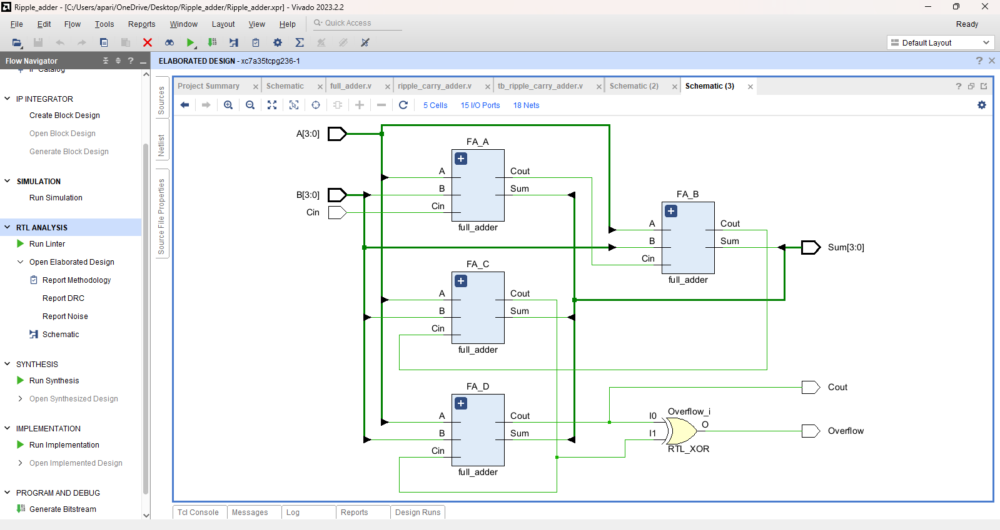

# \# 4-Bit Ripple Carry Adder – Verilog HDL

# 

# This project implements a 4-bit ripple carry adder using full adder modules in Verilog HDL, featuring carry propagation and overflow detection. Simulated and verified using all 512 possible input combinations.

# 

# \## 🔧 Modules

# \- `full\_adder.v` – 1-bit full adder

# \- `ripple\_carry\_adder.v` – 4-bit adder using structural hierarchy

# \- `tb\_ripple\_carry\_adder.v` – Testbench with complete functional coverage

# 

# \## ✅ Features

# \- Modular design using reusable full adder blocks

# \- Signed overflow detection using XOR of carry-in and carry-out of MSB

# \- Fully testbench-verified with 100% functional coverage

# 

# \## 🧪 Simulation

# Simulate using any Verilog simulator (Vivado, ModelSim, etc.). Set `tb\_ripple\_carry\_adder` as the top module.

# 

# \## 💻 Tools Used

# \- Verilog HDL

# \- Xilinx Vivado (for synthesis and RTL simulation)

# 

# \## 📷 Diagram

# 

# 

